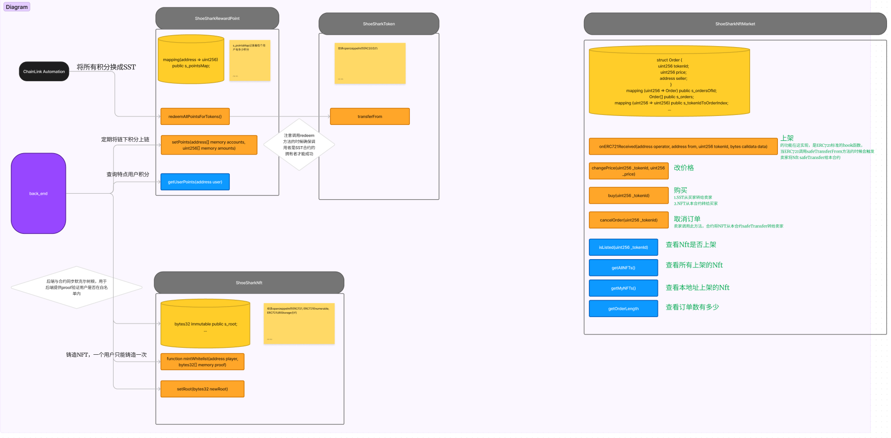

# ShoeShark-contract

Shoe Shark aims to create a decentralized platform for sharing and exploring travel inspirations, leveraging Web3 technology. The name is inspired by the famous Chinese traveler Xu Xiake, where "Shoe" represents walking and traveling, and "Shark" symbolizes exploration and adventure. Shoe Shark encourages users to share travel experiences, inspire each other with travel ideas, and build a community centered around travel enthusiasts.

## Contracts Overview

The ShoeShark-contract consists of the following contracts:

- ShoeSharkRewardPoint.sol
- ShoeSharkToken.sol
- ShoeSharkNft.sol
- ShoeSharkNftMarket.sol

## ShoeShark RewardPoint Contract

This contract defines the rules and limits for different types of user behavior, such as daily sign-ins, user interactions (likes, comments), and content publishing.

Example rules:

- Daily sign-in: +5 points, daily limit of 5 points.
- User interaction: +2 points, daily limit of 10 points.
- Content publishing: +10 points, weekly limit of 30 points.

## ShoeShark Token Contract

Basic Information:

- Token Name: ShoeShark Token (SST)
- Token Symbol: SST
- Token Type: ERC20, with 18 decimal places for consistency with most tokens on Ethereum.
- Total Supply: Set according to project needs and token economic model. For example, 1 billion SST.

## ShoeShark NFT Contract

Basic Information:

- NFT Name: ShoeShark NFT (SHRK)
- Token Symbol: SHRK
- Token Type: ERC721 NFT. Only users in the whitelist (those with points) are allowed to mint once.

## ShoeShark NFT Market Contract

This contract is used for trading SST and SHRK. It provides functions for listing, buying, repricing, and delisting.

## Prerequisites

- Foundry

## Deployment

Deploy the contracts with the following commands:
make deploy ARGS="--network fuji"

Subscribe to Chainlink:
make createSubscription ARGS="--network fuji"

Fund the subscription:
make fundSubscription ARGS="--network fuji"

## Contract Address

ShoeSharkNftMarket,0x09cE8D7E2eC68C4445c8a7D1B922ebc0EFCe2366
ShoeSharkRewardPoint,0xa5ED220f962D90Db0ea27fB677692DE08B13ddad
ShoeSharkToken,0x9d3ce3c0E5282F71D025324312d8Bd80d082538D
ShoeSharkNft,0x69cB35752FbA54291a96c98eE7813b4d8e82fB83
